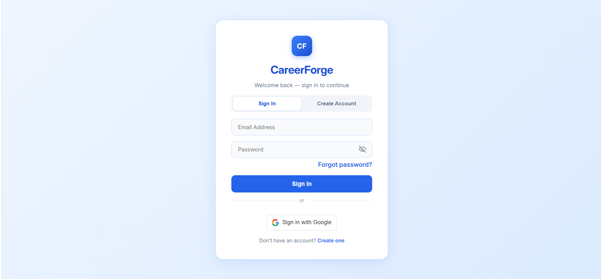
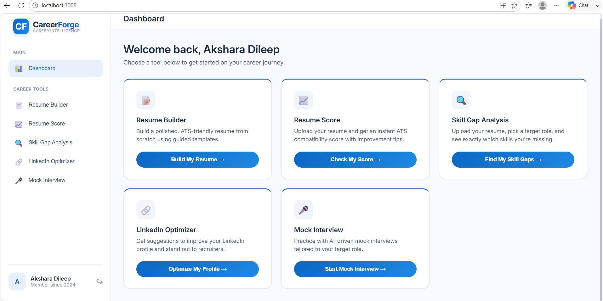
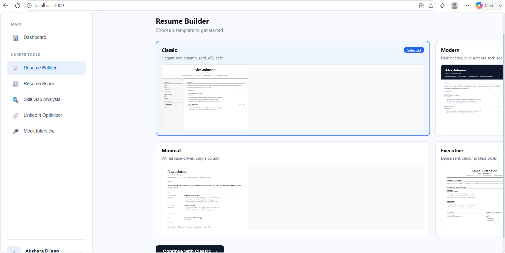
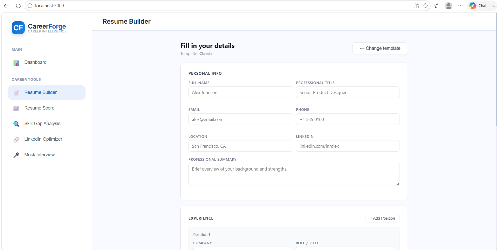
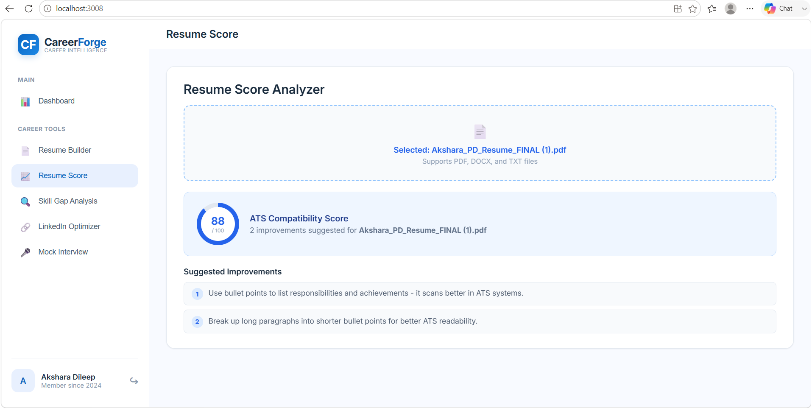
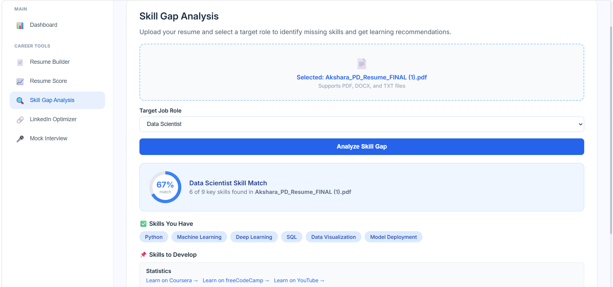
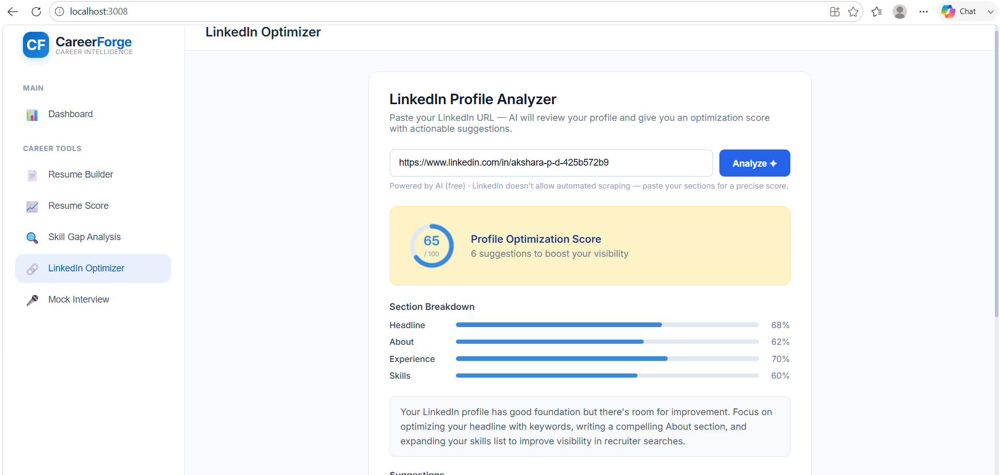
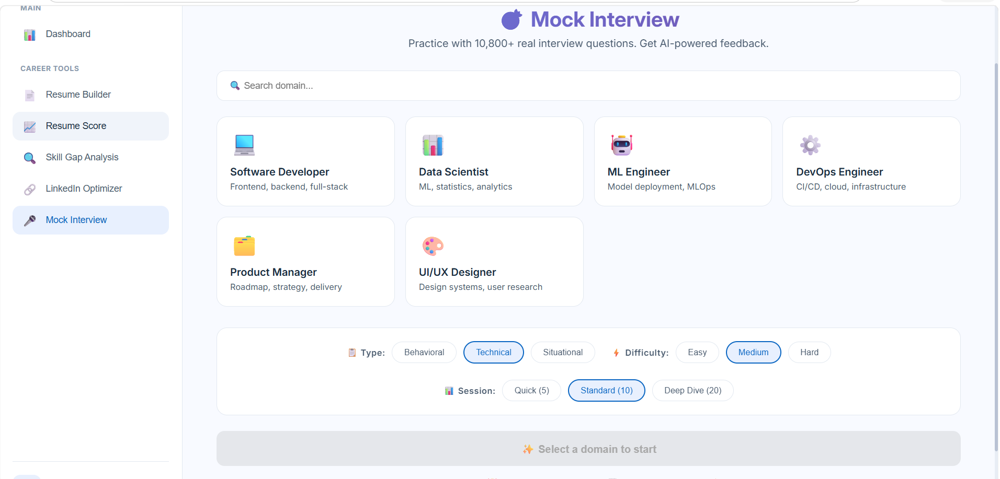

# CareerForge — AI-Powered Resume & Career Optimization Platform

CareerForge is an all-in-one career toolkit that helps job seekers improve their resumes, identify skill gaps, optimize their LinkedIn profiles, and practice for interviews — all in one clean dashboard.

> Built for Vibe Coding Hackathon 2026 

---
## 🚀 Live Demo
 
🔗 **Live App:**  https://ornate-concha-20d5b0.netlify.app/
🎥 **Demo Video:** https://youtu.be/CNYGT5NR0gg
 
---

## 📸 Screenshots

| Login | Dashboard |
|---|---|
|  |  |

| Template Selection | Resume Builder |
|---|---|
|  |  |

| Resume Score | Skill Gap Analysis |
|---|---|
|  |  |

| LinkedIn Optimizer | Mock Interview |
|---|---|
|  |  |


---

## ✨ Features

- **🔐 Authentication** — Email/password signup with profile details, plus Google Sign-In
- **📝 Resume Builder** — Guided resume creation with ATS-friendly templates *(in progress)*
- **📈 Resume Score Analyzer** — Upload a PDF/DOCX/TXT resume and get an instant ATS compatibility score with actionable suggestions
- **🔍 Skill Gap Analysis** — Pick a target role and discover which in-demand skills are missing from your resume, with curated learning links
- **🔗 LinkedIn Optimizer** — AI-powered analysis of your LinkedIn profile with a score out of 100 and section-by-section feedback
- **🎤 Mock Interview** — Practice with 10,000+ domain-specific behavioral, technical, and situational questions, with instant AI-style feedback on your answers

---

## 🛠️ Tech Stack

- **Frontend:** React 19, Create React App
- **Authentication:** Google OAuth (`@react-oauth/google`), JWT decoding
- **Resume Parsing:** `pdfjs-dist` (PDF), `mammoth` (DOCX)
- **AI Integration:** OpenRouter API (via a lightweight Express proxy to keep API keys secure)
- **Styling:** Custom design system (no UI framework dependency)

---

## 🏗️ Architecture

```
┌─────────────────┐       ┌──────────────────┐       ┌──────────────────┐
│   React App      │──────▶│  Express Proxy    │──────▶│  OpenRouter API   │
│  (localhost:3000)│       │ (localhost:3001)  │       │   (AI models)     │
└─────────────────┘       └──────────────────┘       └──────────────────┘
```

The React frontend handles all UI and most logic (resume scoring, skill-gap matching, mock interview question generation/evaluation) locally in the browser. Only the **LinkedIn Optimizer** calls an external AI model, and it does so through a small Node/Express proxy server (`proxy.js`) so that the AI API key is never exposed to the browser.

---

## ⚙️ Setup & Installation

### Prerequisites
- Node.js (v18 or higher)
- npm

### 1. Clone the repository
```bash
git clone https://github.com/aksharadileep/CareerForge-AI-Intelligent-Resume-Career-Optimization-Platform.git
cd CareerForge-AI-Intelligent-Resume-Career-Optimization-Platform
```

### 2. Install dependencies
```bash
npm install
```

### 3. Set up environment variables
Copy the example environment file and add your own API keys:
```bash
cp .env.example .env
```

Edit `.env` and fill in:
```
OPENROUTER_API_KEY=your_openrouter_key_here
REACT_APP_API_URL=http://localhost:8000/api
```

> 🔑 **Get a free OpenRouter API key:** sign up at [openrouter.ai](https://openrouter.ai) — free tier models are available and work with this project.

### 4. Run the AI proxy server (required for LinkedIn Optimizer)
```bash
node proxy.js
```
This starts the proxy on `http://localhost:3001`.

### 5. Run the React app
In a separate terminal:
```bash
npm start
```
The app will open at `http://localhost:3000`.

> **Note:** Without the proxy running, all features still work *except* the LinkedIn Optimizer's AI analysis (it falls back to default suggestions).

---

## 🔑 Google Sign-In Configuration

This project uses Google OAuth for sign-in. The provided Client ID is configured for `localhost:3000`. If you fork this project and run it on a different port or domain, you'll need to:
1. Create your own OAuth Client ID at [Google Cloud Console](https://console.cloud.google.com/apis/credentials)
2. Add your origin (e.g. `http://localhost:3000`) under **Authorized JavaScript origins**
3. Replace the `clientId` in `src/index.js` with your own

---

## 📂 Project Structure

```
src/
├── components/
│   ├── auth/AuthPage.jsx        # Sign in / sign up flow
│   ├── layout/Shell.jsx         # App shell (header + content area)
│   ├── layout/Sidebar.jsx       # Navigation sidebar
│   └── InterviewFeedback.jsx    # Feedback UI for mock interviews
├── pages/
│   ├── Dashboard.jsx            # Landing page with feature cards
│   ├── ResumeBuilder.jsx        # Resume creation tool (in progress)
│   ├── ScoreAnalyzer.jsx        # ATS resume scoring
│   ├── SkillGap.jsx             # Skill gap analysis vs. target role
│   ├── LinkedInOptimizer.jsx    # AI-powered LinkedIn profile review
│   └── MockInterview.jsx        # Interview practice with feedback
├── services/
│   ├── api.js                   # API calls (AI proxy, mock endpoints)
│   ├── aiQuestionGenerator.js   # Interview question bank generator
│   └── aiEvaluationService.js   # Answer evaluation logic
├── hooks/
│   └── useInterviewQuestions.js # Mock interview state management
├── constants/
│   ├── theme.js                 # Design tokens & shared styles
│   └── navigation.js            # Sidebar nav items
└── proxy.js                      # Express server to secure AI API key
```

---

## 🗺️ Roadmap

- [ ] Complete Resume Builder with PDF export
- [ ] Connect to a persistent backend (user accounts, saved resumes)
- [ ] Add more job roles to Skill Gap database
- [ ] Improve Mock Interview with real-time AI evaluation

---

## 👥 Team

- 
- **Akshara P D** — Full-Stack Development
- **Akashay K S** — Full-Stack Development


---

## 📄 License
This project was built for **Vibe Coding Hackathon 2026** by Akshara P D & Akashay K S.

Licensed under the MIT License — feel free to use, modify, and distribute this code for learning purposes.